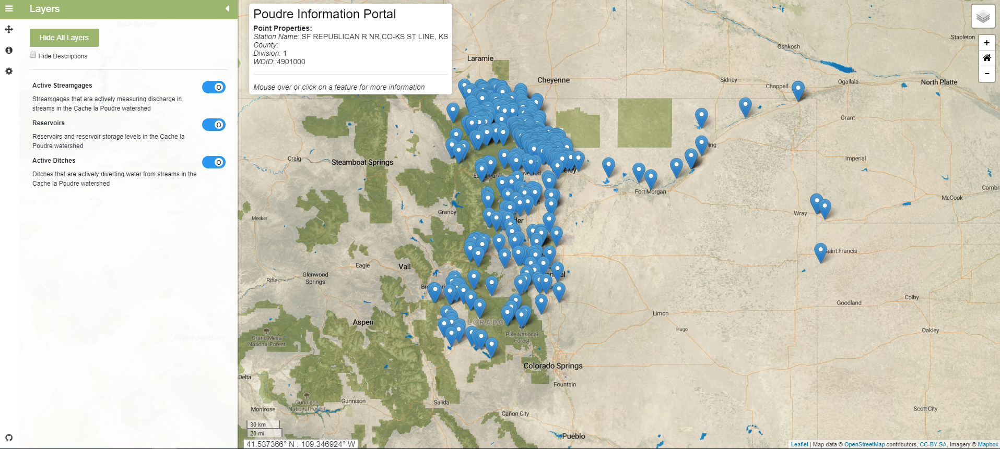

# Map Component

This component contains the files, and sub components that this component depends on for creating the map page within the site, accessible through the navigation bar. 

In this folder:

```
├── map-components
|   ├── animation-tools/ ............. Animation tools component (under development)
|   ├── layer/ ....................... Layer component for the layer controls in the sidebar
|   ├── map-error/ ................... Map error page displayed when map configuration file is not propertly read.
|   ├── sidepanel-info/ .............. Sidepanel info component for the info tab in the sidebar.
|   ├── map.components.css ........... Stylesheet for map component.
|   ├── map.component.html ........... HTML template for map component.
|   ├── map.component.spec.ts ........ Testing file for map component.
|   ├── map.component.ts ............. Typescript file for map component.
|   ├── map.service.ts ............... A service file with helper functions for used in the map component.
|   ├── README.md .................... This file.
```


This component depends on the following components:

* ~~[AnimationToolsComponent](animation-tools/README.md)~~ - Still under development.
* [BackgroundLayerComponent](background-layer-control/README.md)
* [MapErrorComponent](map-components/map-error/README.md)
* [MapLayerComponet](map-components/map-layer-control/README.md)
* [SidePanelInfoComponent](map-components/sidepanel-info/README.md)

#### About Map Component `.ts` File ####

The map component contains the majority of the code within the Angular application. The intent of this site is to dynamically load map data through the use of leaflet, and to display various tools, elements, layers, and information. 

In `map.component.ts` there is a large amount of code that utilizes leaflet to create the individual map which is loaded when clicking on a map link from the navigation bar.

To learn more about developing using Leaflet view the Leaflet documentation [here](<https://leafletjs.com/reference-1.5.0.html>).



## Sidebar

The sidebar is based on an adapted version of the Turbo87 leaflet-sidebar, available on Github at [https://github.com/Turbo87/leaflet-sidebar](https://github.com/Turbo87/leaflet-sidebar).  The leaflet-sidebar-v2 library has been downloaded via `npm` and saved in the `node_modules` folder. The sidebar allows functionality to see more data relevant to the map as well as control layers displayed on the map.
