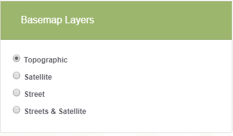

# Background Layer Component #

The background layer component is responsible for adding controls to the sidebar on the left side of the map that allow users to select which background layer they want displayed on the leaflet map. This component is called in `map.component.ts` to dynamically add new layer information to the sidebar.

In this folder:

```
├── layer
|   ├── background-layer-item.component.ts .......... Simple typescript file for an individual layer item.
|   ├── background-layer.component.css .............. Stylesheet for the layer component.
|   ├── background-layer.component.html ............. HTML template for the layer component.
|   ├── background-layer.component.ts ............... Typescript file for layer component.
|   ├── background-layer.directive.ts ............... Contains a directive for an individual layer item.
|   ├── README.md ........................ This file.
```



