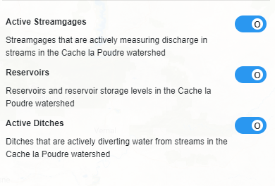

# Layer Component #

The layer component is responsible for adding layer information and controls to the sidebar on the left side of the map. This component is called in `map.component.ts` to dynamically add new layer information to the sidebar.

In this folder:

```
├── layer
|   ├── layer-item.component.ts .......... Simple typescript file for an individual layer item.
|   ├── layer.component.css .............. Stylesheet for the layer component.
|   ├── layer.component.html ............. HTML template for the layer component.
|   ├── layer.component.ts ............... Typescript file for layer component.
|   ├── layer.directive.ts ............... Contains a directive for an individual layer item.
|   ├── README.md ........................ This file.
```



