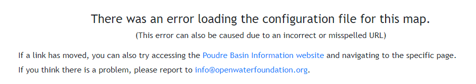

# Map Error Component #

This component creates a page that is displayed when there is an error in reading the .json configuration file for the map component. The map file name is pulled from the URL, so this may also be displayed from a bad link typed into the browser. ex: `/map/map_file_name`. 

```
├── map-error
|   ├── map-error.component.css .......... Stylesheet for map error component.
|   ├── map-error.component.html ......... HTML template for map error component.
|   ├── map-error.component.ts ........... Typescript file for map error component.
|   ├── README.md ........................ This file.
```



