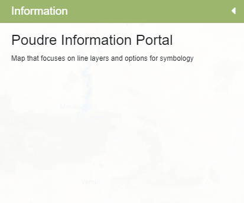

# Side Panel Info Component # 

This component contains the file for creating the information tab on the sidebar. Currently there isn't much information in the info section, but it allows the user to add more details and properties that can be viewed in the information tab.

In this folder:

```
├── sidepanel-info
|   ├── README.md ......................... This file.
|   ├── sidepanel-info.component.css ...... Stylesheet for sidepanel info component.
|   ├── sidepanel-info.component.html ..... HTML template for sidepanel info component.
|   ├── sidepanel-info.component.ts ....... Typescript file for sidepanel info component.
|   ├── sidepanel-info.directive.ts ....... Directive for sidepanel info component.
```



