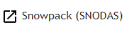

# Navigation Dropdown Component # 

This component creates the individual dropdown menus for the navigation bar. Depending on the type of dropdown link this can result in either a link to a map component in the app, or can result in creating a link to an external site. In [`nav-dropdown.component.ts`](../nav-dropdown.component.ts) this component is called to create a new dropdown item that could either link to an internal map or an external site depending on the configuration file.

Example:

Map Link:   or     External Link:      

In this folder:

```
├── nav-dropdown/
|   ├── nav-dropdown-link/ ............... Folder for dropdown link component (external link)
|   ├── nav-dropdown-option/ ............. Folder for dropdown option component (internal map link)
|   ├── dropdown.directive.ts ............ Directive for dropdown component
|   ├── nav-dropdown.component.css ....... Stylesheet for dropdown component
|   ├── nav-dropdown.component.html ...... HTML template for dropdown component
|   ├── nav-dropdown.component.ts ........ Typescript file for dropdown component
|   ├── README.md ........................ This file.
```

