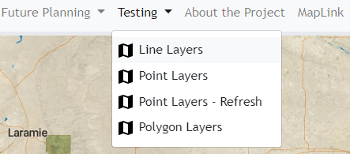

# Tab Component #

The tab component is responsible for dynamically adding various types of tabs to the navigation bar. There are several variations of different tabs that can be created via the configuration file, currently those options are: 

1. A tab with a dropdown option with additional links to maps, external links, or generic-pages.
2. A tab that links to a [generic page](../../generic-page/README.md).
3. A tab that links to a map.

In this folder:

```
├── tab
|   ├── README.md ..................... This current file.
|   ├── tab.component.css ............. Stylesheet for the tabs.
|   ├── tab.component.html ............ Template with logic to handle different types of tabs.
|   ├── tab.component.ts .............. Creates the component for the tab.
|   ├── tab.directive.ts .............. A directive for the tab component.
```



### Dropdown tab

For tabs with a drop down option the configuration json file will contain a menu section specifying the various drop down tabs wanted. 

Below you will find the ```Testing``` tab's dropdown menu in the form of a configuration json file. An image of this tab can also be located above:

```
 ...
   		   "id": "Testing",
           "name": "Testing",
           "align": "left",
           "menus": [
               {
                   "name": "Line Layers",
                   "action": "displayMap",
                   "mapProject": "line_layers_2019-05-15"
               },
               {
                   "name": "Point Layers",
                   "action": "displayMap",
                   "mapProject": "point_layers_2019-05-15"
               },
               {
                    "name": "Point Layers - Refresh",
                    "action": "displayMap",
                    "mapProject": "point_layers_refresh_2019-05-22"
               },
               {
                   "name": "Polygon Layers",
                   "action": "displayMap",
                   "mapProject":"polygon_layers_2019-05-15"
               },
               {
                   "name": "Point Layers - Symbols",
                   "action": "displayMap",
                   "mapProject": "point_layers_symbols_2019-07-12"
               }
           ]
       },
...
```

In this instance the ```Testing``` tab contains a dropdown menu linking to solely maps. it is also possible to have these drop down redirect to more than just map links. This may involve external links, and even generic pages which we will visit shortly.

### Generic Page tab

Generic page tabs are generated using markdown files. Integrating Markdown files and subsequently converting the source code to HTML significantly reduces the code found within the HTML file and benefits the overall user in the long run by eliminating the need to be profoundly skilled in HTML. 

The following function is located within the ``generic-page `` component in the ``generic-page.component.ts`` file. This function reads from a Markdown input file and converts the contents of the file into HTML:

```

  convertMarkdownToHTML(inputFile, outputDiv) {

    $.get(inputFile, (textString) => {
        var converter = new showdown.Converter({tables: true, strikethrough: true});
        document.getElementById(outputDiv).innerHTML = converter.makeHtml(textString);
    }).fail(()=> {
      console.error("The markdown file '" + inputFile + "' could not be read");
      this.router.navigateByUrl('not-found');
    })
    
  }


```


To generate a generic page in a tab the configuration json file will resemble the code below found in ``map-tabs-configuration.json``:

```
...
       {
           "id": "Tab",
           "name": "About the Project",
           "action": "genericPage",
           "align": "right",
           "markdownFile":"about-the-project"
       },

...
```

Visit the ``generic-page`` component's ``README.md`` for more information. 

### MapLink tab

To generate a MapLink page in a tab, the configuration file will resemble the code below fond in ``map-tabs-configuration.json``:

```
... 		
   	  {
           "id": "Tab",
           "name": "MapLink",
           "action": "displayMap",
           "align":"right",
           "mapProject": "line_layers_2019-05-15"
       },
...
```

More specification on how these maps are generated and configured will be found within the ```Map``` component. 

### Tab.component.html 

Dropdown Menus, generic pages, map links, and external pages are all specified within the HTML file. This is how where the code decides  what information to display and how. This is because ``tab.component.html`` is a template for the layout of various types of tabs added to the navigation bar. 

Below are snippets of code that how specify whether the tab is a dropdown menu tab, a generic page, or a MapLink page. 

#### Drop Down Menus

```
<div *ngIf="data.menus; else simpleTab">
```

#### Generic Pages

```
<div *ngIf="data.action == 'genericPage'; else simpleMapTab">
```

#### Map Link page 

```
<ng-template #simpleMapTab>
```


